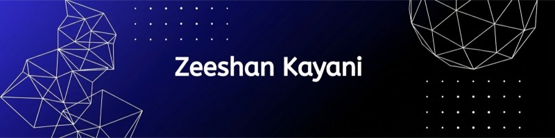

<p align="center">
  
</p>

<div align="center">

<a href="https://www.linkedin.com/in/zeeshan-kayani-0a1459350/"></a>
<a href="https://zenodo.org/records/21815214"></a>
<a href="https://gitlab.com"></a>
<a href="https://github.com/zz-47"></a>

<br/><br/>

<a href="https://isocpp.org"></a>
<a href="https://www.python.org"></a>
<a href="https://fastapi.tiangolo.com"></a>
<a href="https://www.postgresql.org"></a>
<a href="https://www.debian.org"></a>
<a href="https://www.kernel.org"></a>

<br/>


</div>

---

## Research Focus

I study the mathematics of Small Language Models the way an engineer must — derived from first principles, then **measured against the real checkpoint**, never assumed from a spec sheet. The work sits at the intersection of constrained hardware, zero-trust cryptography, and deterministic local inference.

---

## Current Research

- **SLM internals on real weights** — attention math (`1/√d_k` scaling, RoPE rotations, GQA KV-cache), traced to exact layer and tensor shapes in real checkpoints such as SmolLM2-135M.
- **Low-rank decomposition** — LoRA at the weight level: SVD → rank selection → scale-out → deploy-time merging, measured rather than assumed.
- **Steered decoding on CPU** — constrained generation via logit masking on CPU-only runtimes; no GPU, no cloud dependency.
- **Zero-trust local inference** — AES-GCM authenticated state, tmpfs RAM-disk isolation, canary auditing, and zero telemetry as architectural invariants.

---

## System Topology

<details>
<summary><b>Research node — headless Debian topology</b></summary>

```text
                        ┌───────────────────────────────┐
                        │     HEADLESS DEBIAN NODE      │
                        │  Proxmox VE / tmpfs RAM-Disks │
                        └───────────────┬───────────────┘
                                        │
            ┌───────────────────────────┴───────────────────────────┐
            ▼                                                     ▼
┌───────────────────────┐                             ┌───────────────────────┐
│      AEGIS VAULT      │                             │      SLM ENGINE       │
├───────────────────────┤                             ├───────────────────────┤
│ • AES-GCM Encryption  │                             │ • GGUF Quantization   │
│ • N-Gram Filtering    │                             │ • Memory-Mapped Load  │
│ • Canary File Audit   │                             │ • Context Truncation  │
└───────────┬───────────┘                             └───────────┬───────────┘
            │                                                     │
            └──────────────────────────┬──────────────────────────┘
                                       │
                                       ▼
                        ┌───────────────────────────────┐
                        │    MODEL CONTEXT PROTOCOL     │
                        │   Local Agentic Bridge / API  │
                        └───────────────────────────────┘
```

</details>

---

## R&D Matrix

**01 · Edge SLM Optimization & Quantization** — low-bit GGUF (2–4 bit) execution under standard CPU constraints; context truncation and tmpfs RAM-disk caching to isolate execution on legacy hardware.

**02 · Applied Cryptography & Threat Engines** — AEAD / AES-GCM security pipelines; ransomware canary detection and input sanitization via N-gram overlap indexing and regex validation.

**03 · Agentic Protocol Bridges & Forensics** — Model Context Protocol (MCP) as secure local bridges between isolated inference endpoints; Benford's Law anomaly detection over tabular transaction data.

**04 · Bare-Metal Infrastructure & Orchestration** — headless Debian, Proxmox VE, and LXC container networks; kernel tuning and volatile storage routing for deterministic, zero-telemetry operation.

---

## Publication

A research archive is recorded under a live DOI:

<a href="https://zenodo.org/records/21815214"> 10.5281/zenodo.21815214</a>

---

## Activity

<div align="center">


<br/>

<code>DETERMINISM · ZERO DATA LEAKAGE · LOW FOOTPRINT</code>

</div>
